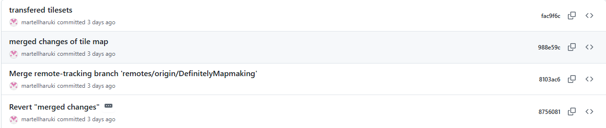

# The title of your game #

## Summary ##

Our game, "Revenge of Zissors", is a top-down zombie shooter; the setting is a zombie apocalypse. Players will get a birds eye view of the map and use a gun to kill zombies. The game features 4 guns pistol, smg, assault rifle, and sniper rifle which have distinct fire rate, accuracy, damage, and bullet velocity stats associated with them. Guns are picked up off the ground. Players can also upgrade their gun by crafting, which consumes scrap, a material dropped by zombies. However, players cannnot move while crafting, so beware! Zombies also drop bandages, allowing the player to heal. Zombies spawn in waves, with each wave getting bigger then the last. Zombies also get ramping health. Be sure to upgrade your gun to keep up! At a certain poin in the game, a boss zombie, Zissors, spawn. Zissors has a unique attack patter, and is much more bulky then the base zombies. Defeating Zissors wins you the game!

## Project Resources

[Web-playable version of your game.](https://martellharuki.itch.io/revenge-of-zissors)  
[Proposal: make your own copy of the linked doc.](https://docs.google.com/document/d/1SG45SkCJg-_YqTW3saoH2T0eArfKZdetLfeUSvTiIBg/edit?tab=t.0#heading=h.i3tv2mxf7h7z)  

## Gameplay Explanation ##

**In this section, explain how the game should be played. Treat this as a manual within a game. Explaining the button mappings and the most optimal gameplay strategy is encouraged.**
The player uses WASD to move, and click to shoot. Players are substantially faster than zombies, so continous shooting and movement is essential to survival. On game start, the player should roam the map looking for a gun spawn, since they are significantly more powerful then the base pistol. The town block the player starts in has 80 potential locations for gun spawns, so keep your eyes peeled! Because zombie count and health scale with wave, upgrading your gun is essential. Crafting allows a boost to either a base stat, or apply a multiplier, which significantly improves your DPS. Crafting requires scrap, which is dropped by zombies, so be sure to kill zombies. Hold E to craft. It takes 2 seconds where the player can't move, so be careful! Zombies also drop bandages, which can be consumed by pressing Q. Something to note is that the camera enables players to see further in the direction they're facing and less in the direction they're not. Because this creates a blind spot, be sure to check your six! The most common way to lose is being encircled since players cannot walk through zombies. If you see the zombies are in every direction, focus on breaking of the death circle before cleaning up the rest of the zombies.

**Add it here if you did work that should be factored into your grade but does not fit easily into the proscribed roles! Please include links to resources and descriptions of game-related material that does not fit into roles here.**

# External Code, Ideas, and Structure #

If your project contains code that: 1) your team did not write, and 2) does not fit cleanly into a role, please document it in this section. Please include the author of the code, where to find the code, and note which scripts, folders, or other files that comprise the external contribution. Additionally, include the license for the external code that permits you to use it. You do not need to include the license for code provided by the instruction team.

If you used tutorials or other intellectual guidance to create aspects of your project, include reference to that information as well.

# Team Member Contributions

This section be repeated once for each team member. Each team member should provide their name and GitHub user information.

# Bill

# Patrick
## Github: Chunkio
## Main Role: Systems and Tools Engineer
I made all the menus and screens for the game, and set up how players control their character.

UI Manager System - Created a UI manager that controls all the different menus and screens in one place. This includes the pause menu, title screen, health bar, and hotbar. The manager keeps everything organized and makes it easy to show or hide different UI elements when needed. 

https://github.com/martellharuki/ECS179FinalProject/blob/main/Scripts/hud.gd

Pause Menu System - Implemented a fully functional pause screen with resume and return-to-title functionality. This system halts game state while maintaining UI responsiveness. The pause system uses Godot's process pausing and implements the State Pattern to ensure clean transitions between play and pause states. 

https://github.com/martellharuki/ECS179FinalProject/blob/main/scripts/pause_screen.gd

Main Menu - Created the title screen with three core buttons (Start, How to Play, Quit) that serve as the game's entry point. This implements scene management and UI navigation hierarchies, ensuring smooth transitions between game states. 

https://github.com/martellharuki/ECS179FinalProject/blob/main/Scripts/title_screen.gd

Health Bar - Developed a responsive HP bar that updates in real-time as the player takes damage. The UI subscribes to health change events from the player controller. The visual feedback provides crucial game feel elements that communicate player state clearly and immediately.

https://github.com/martellharuki/ECS179FinalProject/blob/main/Scripts/health_bar.gd

Player Controls - Set up the basic WASD movement controls so players can move around in the game.

https://github.com/martellharuki/ECS179FinalProject/blob/main/Scripts/player/player.gd

## Sub Role: Accessibility and Usability Design
In this role, I focused on making the game more accessible and improving the overall user experience through iterative design and testing features. This connects to the Usability Engineering and Iterative Design principles emphasized throughout the course.

Testing Buttons - Created a comprehensive set of testing inputs (heal button, damage button, instant win) to facilitate rapid iteration and debugging of UI systems. These testing features allowed for quick validation of visual feedback systems without requiring full gameplay loops.  
https://github.com/martellharuki/ECS179FinalProject/blob/fc74ab76b2a36d901162826293c1c640809269a2/Scripts/player/player.gd#L96-L98

Hotbar UI - Designed and implemented the hotbar interface structure that serves as the foundation for the inventory system.

Win and Lose Screens - Developed win screen, lose screen, and objective screen to clearly communicate game state to players. The objective screen appears immediately after game start, providing clear player goals ("Survive"). These screens implement feedback systems and ensure players always understand their current objective and performance.

https://github.com/martellharuki/ECS179FinalProject/blob/main/Scenes/lose_screen.tscn
https://github.com/martellharuki/ECS179FinalProject/blob/main/Scenes/win_screen.tscn
https://github.com/martellharuki/ECS179FinalProject/blob/main/Scenes/objective_screen.tscn
https://github.com/martellharuki/ECS179FinalProject/blob/main/Scripts/win_screen.gd
https://github.com/martellharuki/ECS179FinalProject/blob/main/Scripts/lose_screen.gd
https://github.com/martellharuki/ECS179FinalProject/blob/main/Scripts/objective_screen.gd

Score System - Added a score counter in HUD.gd that tracks how many enemies you kill. The score shows up on the win/lose screens at the end so you can see how well you did. 

## Other Contributions:
Visual Setup - Assisted with the visual polish of the game by integrating graphical assets including title graphics, background images, and button icons into their appropriate UI screens. 

Removed Features - Developed and later removed an inventory screen system after determining it added unnecessary complexity to the core gameplay loop.

# Kaylie

# Haruki Martell
## Github: martellharuki
## Main Role: Systems and Tools Engineer
* #### Entity and Live Entity Classes/Scenes
  These classes add some base functionality to objects that have a sprite and hitbox. Entity handles showing and hiding sprites, and live entity handles a health or timer option to these objects giving them a "lifespan". When their life expires, it deleted the node. 
  **Relation to Course Content:** This ties into the component system learnings since the entity classes give a base implementation of an object's controller, on which other components can be added upon.
  **Commits**: [Entity Commit](https://github.com/martellharuki/ECS179FinalProject/commit/ee5b1d126b91f9faae15dcf99b7d9fcc06f886c9)

* #### Bullets and Base Weapon:
  By extending the Live Entity class, we make a bullet object which dies after a certain life span. The bullet also has an Area 2D which detects a collision, dying on rigid objects and ignoring the player. Given a velocity and direction, the bullet object also updates each frame to move. The bullet is fired by a weapon handler in the player node. The weapon handler is a factory which instanties the bullet scenes, and gives the bullet a velocity, direction, and damage. These values are determined by a weapon spec, which represents the players current weapon. On click, the player commands the weapon to fire. The weapon checks to see if it can fire based on fire rate (also part of spec) and builds the bullet if it can.
  **Relation to Course Content:** Factory, Component, Command, Mechanics (Weapon spec)
  **Commits:** [Base Bullet Scene](https://github.com/martellharuki/ECS179FinalProject/commit/d8f97fe6202c1b169f241070a819d2a430346fbe) | [Weapon Spec and Bullet Logic](https://github.com/martellharuki/ECS179FinalProject/commit/026e796080583bf0e4d7aabdbedd5ac573448217)

* #### Action Display:
  This is a node (named Action Item) that other handlers use to depict an action being taken. Specifically, it features a progress bar, used in crafting and item pick up as well as text, which tells the player the buff they crafted. Other controllers access this node through its unique name, and they have an option to set the bar or the text. The Action Handler then takes care of the specifics, including: hiding text after a set time, prioritizing crafting progress over item pick up, and resetting the bar. The intent is to convey action information. 
**Relation to Course Content:** Command pattern, Components, and Mechanics
**Commits:** [Action Item (Look for action_item.gd)](https://github.com/martellharuki/ECS179FinalProject/commit/8db35cda48a6c008784f684feb0411ecf990dde6)

* #### Item Pick Up:
  We once again extend the Live Entity to create items, which can drop for 20 seconds. The item scene also contians an enum of the item type and its grouped under "item". The player then contains an Item Pickup Handler. The handler consists of the handler and then a child area 2D. The child area is responsible for telling the handler if an item is hovered and which item that is. The handler is responsible for keeping track of progress, telling the Action Display what to depict, and manages item pick up by deleting the item and commanding the proper containers (gun, scrap, and bandage). The intent is to allow players to pick up items while making them work for it (stand ontop for a set time).
  **Relation to Course Content:** Command Pattern, Components, and Mechanics
  **Commits:**  [Item Pickup Collider and Handler](https://github.com/martellharuki/ECS179FinalProject/commit/8db35cda48a6c008784f684feb0411ecf990dde6) | [More Types for Item Pickup Handler](https://github.com/martellharuki/ECS179FinalProject/commit/684ca384a042d73789059ef3112342fcc5352513#diff-bfd5490bc6c085f12d45d1b61a5447b1932d388cdd862dfa2c26206c3c3dba3f) | [Enables Players to Hover Over Multiple Items and Updates the Hud](https://github.com/martellharuki/ECS179FinalProject/commit/2f422c9853a9df2e85c21d84458e12a43544fa1d)

* #### Gun Spawning and Pickup: 
  Extending the item scene, we add another enum depicting what kind of gun it is. Each gun then gets its own scene. On gun pickup, the Item Pickup System commands the Weapon Handler to switch to a new gun, passing in the enum. The weapon handler then gets its gun by using a static function that holds each base weapon spec. The weapon handler also commands the player animator to change animations (more on this later). Item spawning uses the Item Spawning Handler, which contains possible spawn locations and has a chance to instantiate them every second. The intent is adding gun drops randomly around the world. The gun is a live entity, so it deletes after a delay
**Relation to Course Content**: Command Pattern, Factory
**Commits:** [Item Spawner (used to spawn scrap, refactored for guns)](https://github.com/martellharuki/ECS179FinalProject/commit/35c6e4e907b9b6d1d42c350e23ab0ba475fd4bcd) | [Adding Gun Scenes To Item Spawner](https://github.com/martellharuki/ECS179FinalProject/commit/684ca384a042d73789059ef3112342fcc5352513#diff-bfd5490bc6c085f12d45d1b61a5447b1932d388cdd862dfa2c26206c3c3dba3f)

* #### Crafting
  Added a crafting handler that handles crafting when E is pressed. It commands the ActionItem node to display the progress. When completing crafting, it commands its child, UpgradeSpec to randomly upgrade a gun value, which can either be a base increase or an increase to a multiplier. The intent is to reward taking to time to pick up scrap while adding an element of RNG to it. The crafting handler also locks player movement. The weapon handler instantiates bullets by taking (gun_spec + upgrade_spec_base) * upgrade_spec_mult
  **Relation to Course Content:** Component, Command, Mechanics
  **Commits:** [Crafting and Upgrade Spec](https://github.com/martellharuki/ECS179FinalProject/commit/8db35cda48a6c008784f684feb0411ecf990dde6#diff-3adcf11f7abf00c3186f15d21a9bafd37b3d47830020eeb470f381cefb754d7a)

* #### Zombie Item Drops:
  Added zombie item drops by having zombies command the item spawner to roll for a chance to drop an item. Zombies pass their location. Should the roll succeed, the spawner will spawn an item at the passed location. The intent is to reward players for killing zombies.
  **Relation to Course Content:** Command, Mechanics
  **Commits:** [Zombie Drops Scrap](https://github.com/martellharuki/ECS179FinalProject/commit/684ca384a042d73789059ef3112342fcc5352513#diff-7c2affd6258b13da46a6094e8a596d55de9758511f1a8ba15294ce3f64689eb6) | [Zombie Scrap Drop Additions](https://github.com/martellharuki/ECS179FinalProject/commit/9c5d126799a899725850e253f7d121119fef43ec#diff-78f6ba713faf4d8fda8490938d6e8db139b5864aa41b708a25a7c4c74ab0017d) | [Zombie Drops Bandage](https://github.com/martellharuki/ECS179FinalProject/commit/518c9199071563baa00e28fb91ac32ba37f758a3#diff-7c2affd6258b13da46a6094e8a596d55de9758511f1a8ba15294ce3f64689eb6) 
## Sub Role: Build and Release Manager
* #### Built and Pushed Webversion
  I was in charge of uploading the game to itch.io
* #### Helped Teammates Merge Changes:
  I helped our team merge their changes in. Here are some exmaples:
  * Helped Hao merge zombie changes in on call
  * Kaylie's tile map changes was corrupting our World.tscn and deleting progress, so I merged the branches correctly. 
  * Me and another teammate both pushed bandage dropping logic, so I reverted the duplicate changes. 
## Other Contributions:
* #### Animation Handling:
  Imported the player animation and created an animation handler where the player can command different animations. The animation handler will account for the equipted gun when determining animations.
  **Relation to Course Content:** Component design pattern
  **Commits:** [Animations](https://github.com/martellharuki/ECS179FinalProject/commit/684ca384a042d73789059ef3112342fcc5352513)

* #### Audio Handling
  Implemented some sounds before the demo since the audio person was busy. Made an audio handler that gets commanded to play certain sounds. All sounds found online for free. Trimmed gunshot to fit our game. Intent was to add some audio since a silent game is bad.
  **Links to Sounds**: [Gunshot](https://pixabay.com/sound-effects/gun-fire-346766/) | [Music](https://pixabay.com/music/video-games-356-8-bit-chiptune-game-music-357518/)
  **Relation to Course Content:** Game feel, Component, Command
# Hao

# Joseph

For each team member, you shoudl work of your role and sub-role in terms of the content of the course. Please look at the role sections below for specific instructions for each role.

Below is a template for you to highlight items of your work. These provide the evidence needed for your work to be evaluated. Try to have at least four such descriptions. They will be assessed on the quality of the underlying system and how they are linked to course content. 

*Short Description* - Long description of your work item that includes how it is relevant to topics discussed in class. [link to evidence in your repository](https://github.com/dr-jam/ECS189L/edit/project-description/ProjectDocumentTemplate.md)

Here is an example:  
*Procedural Terrain* - The game's background consists of procedurally generated terrain produced with Perlin noise. The game can modify this terrain at run-time via a call to its script methods. The intent is to allow the player to modify the terrain. This system is based on the component design pattern and the procedural content generation portions of the course. [The PCG terrain generation script](https://github.com/dr-jam/CameraControlExercise/blob/513b927e87fc686fe627bf7d4ff6ff841cf34e9f/Obscura/Assets/Scripts/TerrainGenerator.cs#L6).

You should replay any **bold text** with your relevant information. Liberally use the template when necessary and appropriate.

Add addition contributions int he Other Contributions section.

## Main Roles ##

## Sub-Roles ##

## Other Contributions ##
